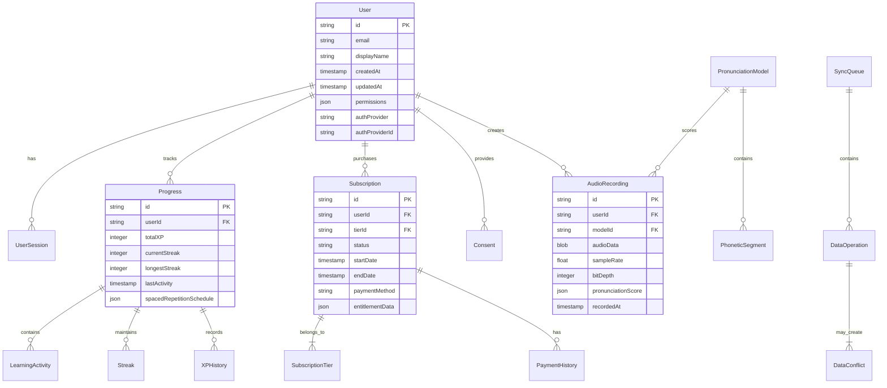

# Design Document

## Overview

This document outlines the technical design for implementing production-ready features in a language-learning application based on a comprehensive 250-point audit checklist. The system addresses 12 critical areas spanning authentication, data modeling, audio processing, offline functionality, subscription management, compliance, AI integration, performance, accessibility, deployment, and data persistence.

### System Context

The language-learning application is a React Native/Expo mobile application targeting both iOS and Android platforms. The primary architectural pattern follows a layered approach with clear separation between presentation, business logic, and data layers. The system integrates with multiple external services including authentication providers, payment processors, AI services, and monitoring platforms.

### Key Design Goals

1. **Security-First Architecture**: Implement robust authentication with OAuth 2.0, row-level security, and multi-factor authentication
2. **Resilient Data Management**: Design offline-first architecture with automatic synchronization and conflict resolution
3. **Real-Time Audio Processing**: Create high-fidelity audio pipeline for pronunciation scoring with AI integration
4. **Scalable Learning Tracking**: Implement progress tracking with XP, streaks, and spaced repetition algorithms
5. **Compliance by Design**: Build privacy compliance and accessibility features into the core architecture
6. **Production Observability**: Integrate comprehensive monitoring, error tracking, and deployment capabilities

### Technical Constraints

- **Platform**: React Native/Expo SDK 57+ with backward compatibility to Android API 26
- **Performance**: 2-second application launch time, 60 FPS animations on mid-range devices
- **Offline Capability**: Full functionality without network for 7 days of cached content
- **Security**: 256-bit encryption for authentication, row-level security for data access
- **Compliance**: GDPR, App Store/Google Play privacy requirements, WCAG 2.1 AA accessibility

## Architecture

### High-Level Architecture

The system follows a modular microservices-inspired architecture within a monorepo structure, with clear boundaries between:

1. **Mobile Application Layer**: React Native/Expo frontend with native modules
2. **Business Logic Layer**: TypeScript/JavaScript services handling core application logic
3. **Data Access Layer**: Local storage (SQLite) with synchronization to cloud databases
4. **External Integration Layer**: Services for authentication, payments, AI processing, monitoring

### Component Architecture

```
┌─────────────────────────────────────────────────────────────────────────┐
│                        Mobile Application (Expo)                        │
├─────────────────────────┬─────────────────────────┬─────────────────────┤
│     UI Components       │     Business Logic      │    Native Modules   │
│  • Authentication UI    │  • Auth Service         │  • expo-audio       │
│  • Progress Tracking UI │  • Progress Tracker     │  • expo-sqlite      │
│  • Pronunciation UI     │  • Audio Pipeline       │  • expo-notifications│
│  • Subscription UI      │  • Offline Synchronizer │  • expo-camera      │
│  • Accessibility UI     │  • Compliance Manager   │                     │
└─────────────────────────┴─────────────────────────┴─────────────────────┘
                              │              │              │
                              ▼              ▼              ▼
┌─────────────────────────────────────────────────────────────────────────┐
│                     Data & Integration Layer                            │
├──────────────┬──────────────┬──────────────┬──────────────┬─────────────┤
│ Local Storage│ Auth Providers│ Payment      │ AI Services  │ Monitoring  │
│ • SQLite     │ • Google      │ • Stripe     │ • OpenAI     │ • Sentry    │
│ • MMKV       │ • Apple       │ • App Store  │ • ElevenLabs │ • EAS Update│
│ • AsyncStorage│ • Facebook   │ • Google Play│              │ • CloudWatch│
└──────────────┴──────────────┴──────────────┴──────────────┴─────────────┘
```

### Data Flow

1. **Authentication Flow**:
   ```
   User → Authentication UI → Auth Service → OAuth Provider → Token Management → RLS Policies
   ```

2. **Progress Tracking Flow**:
   ```
   Lesson Complete → Progress Tracker → Local Storage → Sync Queue → Cloud Database
   ```

3. **Audio Processing Flow**:
   ```
   User Speech → Audio Recording → Preprocessing → AI Scoring → Feedback Display → Progress Update
   ```

4. **Offline Synchronization Flow**:
   ```
   Local Change → Write to SQLite → Add to Sync Queue → Network Check → Conflict Resolution → Server Sync
   ```

### Technology Stack

- **Frontend**: React Native 0.74+, Expo SDK 57+, TypeScript, React Navigation 7+
- **State Management**: TanStack Query (React Query) + Zustand
- **Local Database**: SQLite with TypeORM or WatermelonDB
- **Authentication**: expo-auth-session, Supabase Auth, OAuth 2.0
- **Audio Processing**: expo-audio, react-native-webrtc for real-time
- **Payment Processing**: Stripe React Native SDK, react-native-iap
- **AI Integration**: OpenAI SDK, custom pronunciation models
- **Monitoring**: Sentry, Expo Application Services (EAS)
- **Testing**: Jest, React Native Testing Library, Detox

### Deployment Architecture

The application uses Expo Application Services (EAS) for:
- Over-the-air updates via EAS Update
- Build automation for iOS and Android
- Preview deployments for testing
- Managed app distribution

## Components and Interfaces

### 1. Authentication Service (`AuthService`)

**Responsibilities**:
- Manage user authentication flows (OAuth 2.0, social auth, email/password)
- Handle token management and refresh
- Implement multi-factor authentication
- Integrate with row-level security policies

**Interfaces**:
```typescript
interface AuthService {
  signIn(provider: AuthProvider, credentials: Credentials): Promise<AuthSession>;
  signOut(): Promise<void>;
  getCurrentSession(): Promise<AuthSession | null>;
  refreshToken(): Promise<string>;
  enableMFA(method: MFAMethod): Promise<void>;
  verifyMFA(code: string): Promise<boolean>;
}

interface AuthSession {
  userId: string;
  accessToken: string;
  refreshToken: string;
  expiresAt: Date;
  permissions: string[];
}
```

**Dependencies**: expo-auth-session, @supabase/supabase-js, expo-secure-store

### 2. Row-Level Security Service (`RLSService`)

**Responsibilities**:
- Enforce data access policies based on user roles and permissions
- Evaluate policies in under 100ms
- Update access controls within 5 seconds of permission changes
- Cache authentication tokens for offline use (max 24 hours)

**Interfaces**:
```typescript
interface RLSService {
  evaluatePolicy(resource: Resource, action: Action, user: User): Promise<boolean>;
  updatePolicies(userId: string, newPermissions: Permission[]): Promise<void>;
  getCachedAccess(userId: string): Promise<CachedAccess | null>;
  invalidateCache(userId: string): Promise<void>;
}
```

**Dependencies**: Supabase PostgreSQL with RLS policies, Redis for caching

### 3. Progress Tracker (`ProgressTracker`)

**Responsibilities**:
- Track XP, streaks, and learning progress
- Implement spaced repetition algorithm
- Manage local storage and synchronization
- Provide progress visualizations

**Interfaces**:
```typescript
interface ProgressTracker {
  recordActivity(activity: LearningActivity): Promise<ProgressUpdate>;
  getStreak(userId: string): Promise<number>;
  getXP(userId: string): Promise<number>;
  scheduleReview(itemId: string, intervals: number[]): Promise<Schedule>;
  syncProgress(): Promise<SyncResult>;
}

interface LearningActivity {
  id: string;
  type: 'lesson' | 'quiz' | 'pronunciation';
  difficulty: 'easy' | 'medium' | 'hard';
  completedAt: Date;
  metadata: Record<string, any>;
}
```

**Dependencies**: SQLite, WatermelonDB, date-fns for date calculations

### 4. Audio Pipeline (`AudioPipeline`)

**Responsibilities**:
- Capture audio at 44.1kHz sample rate with 16-bit depth
- Provide real-time waveform visualization (30 FPS)
- Integrate with AI pronunciation scoring
- Support offline audio models (minimum 50 cached)

**Interfaces**:
```typescript
interface AudioPipeline {
  startRecording(config: AudioConfig): Promise<RecordingSession>;
  stopRecording(sessionId: string): Promise<AudioBuffer>;
  analyzePronunciation(audio: AudioBuffer, reference: PronunciationModel): Promise<PronunciationScore>;
  getWaveformData(sessionId: string): Promise<WaveformData[]>;
  cacheModel(model: PronunciationModel): Promise<void>;
}

interface PronunciationScore {
  accuracy: number; // 0-100%
  phoneticBreakdown: PhoneticSegment[];
  recommendations: string[];
  confidence: number; // 0-1
}
```

**Dependencies**: expo-audio, react-native-webrtc, TensorFlow Lite

### 5. Offline Synchronizer (`OfflineSynchronizer`)

**Responsibilities**:
- Detect network connectivity changes
- Queue local operations for synchronization
- Resolve conflicts using last-write-wins algorithm
- Provide optimistic UI updates with rollback

**Interfaces**:
```typescript
interface OfflineSynchronizer {
  queueOperation(operation: DataOperation): Promise<string>;
  syncAll(): Promise<SyncSummary>;
  resolveConflict(conflict: DataConflict): Promise<ResolutionResult>;
  getSyncStatus(): Promise<SyncStatus>;
  enableOptimisticUpdates(enabled: boolean): Promise<void>;
}

interface SyncSummary {
  syncedRecords: number;
  conflictsResolved: number;
  failedOperations: FailedOperation[];
  duration: number;
}
```

**Dependencies**: NetInfo, SQLite, background fetch API

### 6. Subscription Manager (`SubscriptionManager`)

**Responsibilities**:
- Process payments through Stripe and app stores
- Validate entitlements server-side every 24 hours
- Manage subscription tiers (Free, Premium, Pro)
- Handle payment failures and grace periods

**Interfaces**:
```typescript
interface SubscriptionManager {
  purchaseSubscription(tier: SubscriptionTier, paymentMethod: PaymentMethod): Promise<PurchaseResult>;
  validateEntitlement(userId: string): Promise<EntitlementStatus>;
  cancelSubscription(userId: string): Promise<void>;
  handlePaymentFailure(userId: string): Promise<RetryOptions>;
  getAvailableTiers(): Promise<SubscriptionTier[]>;
}
```

**Dependencies**: @stripe/stripe-react-native, react-native-iap, server-side validation

### 7. Compliance Manager (`ComplianceManager`)

**Responsibilities**:
- Implement GDPR-compliant consent dialogs
- Display AI disclosure notices
- Enforce data retention policies
- Handle data deletion requests (within 30 days)

**Interfaces**:
```typescript
interface ComplianceManager {
  requestConsent(purposes: ConsentPurpose[]): Promise<ConsentResult>;
  showAIDisclosure(feature: string): Promise<void>;
  deleteUserData(userId: string): Promise<DeletionStatus>;
  verifyAge(userAge: number): Promise<AgeVerificationResult>;
  logPrivacyEvent(event: PrivacyEvent): Promise<void>;
}
```

**Dependencies**: expo-document-picker, secure storage, audit logging

### 8. AI Processor (`AIProcessor`)

**Responsibilities**:
- Check quota and usage limits
- Fall back to rule-based alternatives when AI unavailable
- Filter inappropriate content with multiple safety layers
- Maintain audit logs of AI interactions

**Interfaces**:
```typescript
interface AIProcessor {
  processPronunciation(audio: AudioBuffer): Promise<PronunciationAnalysis>;
  generateContent(prompt: string, constraints: ContentConstraints): Promise<GeneratedContent>;
  moderateContent(content: string): Promise<ModerationResult>;
  getUsageMetrics(): Promise<UsageMetrics>;
  fallbackToRules(input: any): Promise<any>;
}
```

**Dependencies**: OpenAI SDK, custom rule engine, content moderation APIs

### 9. Monitoring System (`MonitoringSystem`)

**Responsibilities**:
- Track performance metrics with Sentry integration
- Capture detailed error diagnostics
- Trigger alerts for critical issues
- Support A/B testing for feature rollouts

**Interfaces**:
```typescript
interface MonitoringSystem {
  captureError(error: Error, context: ErrorContext): Promise<string>;
  trackPerformance(metric: PerformanceMetric): Promise<void>;
  setUser(user: User): Promise<void>;
  startTransaction(name: string): Promise<Transaction>;
  configureABTest(test: ABTestConfig): Promise<void>;
}
```

**Dependencies**: @sentry/react-native, expo-application, performance monitoring

## Data Models

### Entity-Relationship Diagram



### Core Data Models

#### 1. User Model
```typescript
interface User {
  id: string;
  email: string;
  displayName: string;
  createdAt: Date;
  updatedAt: Date;
  authProvider: 'google' | 'apple' | 'facebook' | 'email';
  authProviderId: string;
  permissions: Permission[];
  preferences: UserPreferences;
  metadata: Record<string, any>;
}

interface Permission {
  resource: string;
  actions: string[];
  conditions?: Record<string, any>;
}
```

#### 2. Progress Model
```typescript
interface Progress {
  id: string;
  userId: string;
  totalXP: number;
  currentStreak: number;
  longestStreak: number;
  lastActivity: Date;
  dailyGoals: DailyGoal[];
  achievements: Achievement[];
  spacedRepetitionSchedule: SpacedRepetitionItem[];
}

interface SpacedRepetitionItem {
  itemId: string;
  nextReview: Date;
  interval: number; // days
  easeFactor: number;
  repetitions: number;
}
```

#### 3. Audio Recording Model
```typescript
interface AudioRecording {
  id: string;
  userId: string;
  modelId: string;
  audioData: ArrayBuffer; // Encoded as base64 for storage
  sampleRate: number; // 44100
  bitDepth: number; // 16
  duration: number; // seconds
  pronunciationScore: PronunciationScore;
  recordedAt: Date;
  syncStatus: 'pending' | 'synced' | 'conflict';
}

interface PronunciationScore {
  overallAccuracy: number;
  segments: PhoneticSegment[];
  confidence: number;
  feedback: string[];
  referenceText: string;
}
```

#### 4. Subscription Model
```typescript
interface Subscription {
  id: string;
  userId: string;
  tierId: string;
  status: 'active' | 'canceled' | 'expired' | 'past_due';
  startDate: Date;
  endDate: Date;
  autoRenew: boolean;
  paymentMethod: PaymentMethod;
  lastVerified: Date;
  gracePeriodEnd?: Date;
}

interface SubscriptionTier {
  id: string;
  name: 'free' | 'premium' | 'pro';
  price: number;
  currency: string;
  billingPeriod: 'monthly' | 'yearly';
  features: TierFeature[];
  limits: TierLimits;
}
```

#### 5. Sync Queue Model
```typescript
interface SyncQueue {
  id: string;
  operationId: string;
  userId: string;
  entityType: string;
  entityId: string;
  operation: 'create' | 'update' | 'delete';
  data: Record<string, any>;
  timestamp: Date;
  status: 'pending' | 'processing' | 'completed' | 'failed';
  retryCount: number;
  lastError?: string;
  conflictResolution?: ConflictResolution;
}

interface ConflictResolution {
  strategy: 'last_write_wins' | 'user_decision' | 'merge';
  resolvedBy?: string;
  resolvedAt?: Date;
  originalData?: Record<string, any>;
  resolvedData: Record<string, any>;
}
```

### Database Schema Design

#### PostgreSQL (Cloud - Supabase)
```sql
-- Users table with RLS policies
CREATE TABLE users (
  id UUID PRIMARY KEY DEFAULT gen_random_uuid(),
  email VARCHAR(255) UNIQUE NOT NULL,
  display_name VARCHAR(100),
  auth_provider VARCHAR(50) NOT NULL,
  auth_provider_id VARCHAR(255) NOT NULL,
  created_at TIMESTAMPTZ DEFAULT NOW(),
  updated_at TIMESTAMPTZ DEFAULT NOW(),
  metadata JSONB DEFAULT '{}'
);

-- Enable Row-Level Security
ALTER TABLE users ENABLE ROW LEVEL SECURITY;

-- RLS Policy: Users can only read their own data
CREATE POLICY user_select_policy ON users
  FOR SELECT USING (auth.uid() = id);

-- Progress tracking table
CREATE TABLE progress (
  id UUID PRIMARY KEY DEFAULT gen_random_uuid(),
  user_id UUID REFERENCES users(id) ON DELETE CASCADE,
  total_xp INTEGER DEFAULT 0,
  current_streak INTEGER DEFAULT 0,
  longest_streak INTEGER DEFAULT 0,
  last_activity TIMESTAMPTZ,
  spaced_repetition_schedule JSONB DEFAULT '[]',
  created_at TIMESTAMPTZ DEFAULT NOW(),
  updated_at TIMESTAMPTZ DEFAULT NOW()
);

-- Audio recordings table
CREATE TABLE audio_recordings (
  id UUID PRIMARY KEY DEFAULT gen_random_uuid(),
  user_id UUID REFERENCES users(id) ON DELETE CASCADE,
  model_id UUID REFERENCES pronunciation_models(id),
  audio_data BYTEA,
  sample_rate INTEGER DEFAULT 44100,
  bit_depth INTEGER DEFAULT 16,
  duration DECIMAL(5,2),
  pronunciation_score JSONB,
  recorded_at TIMESTAMPTZ DEFAULT NOW(),
  sync_status VARCHAR(20) DEFAULT 'pending'
);

-- Subscriptions table
CREATE TABLE subscriptions (
  id UUID PRIMARY KEY DEFAULT gen_random_uuid(),
  user_id UUID REFERENCES users(id) ON DELETE CASCADE,
  tier_id VARCHAR(50) NOT NULL,
  status VARCHAR(20) DEFAULT 'active',
  start_date TIMESTAMPTZ NOT NULL,
  end_date TIMESTAMPTZ,
  auto_renew BOOLEAN DEFAULT true,
  last_verified TIMESTAMPTZ,
  payment_data JSONB,
  created_at TIMESTAMPTZ DEFAULT NOW(),
  updated_at TIMESTAMPTZ DEFAULT NOW()
);
```

#### SQLite (Local - Mobile)
```sql
-- Local users table
CREATE TABLE local_users (
  id TEXT PRIMARY KEY,
  email TEXT UNIQUE NOT NULL,
  display_name TEXT,
  auth_provider TEXT NOT NULL,
  permissions TEXT, -- JSON string
  local_created_at DATETIME DEFAULT CURRENT_TIMESTAMP,
  local_updated_at DATETIME DEFAULT CURRENT_TIMESTAMP,
  sync_status TEXT DEFAULT 'pending'
);

-- Local progress table
CREATE TABLE local_progress (
  id TEXT PRIMARY KEY,
  user_id TEXT NOT NULL,
  total_xp INTEGER DEFAULT 0,
  current_streak INTEGER DEFAULT 0,
  last_activity DATETIME,
  local_modifications INTEGER DEFAULT 0,
  sync_pending BOOLEAN DEFAULT false,
  FOREIGN KEY (user_id) REFERENCES local_users(id)
);

-- Local sync queue
CREATE TABLE sync_queue (
  id TEXT PRIMARY KEY,
  operation_type TEXT NOT NULL, -- 'create', 'update', 'delete'
  entity_type TEXT NOT NULL, -- 'user', 'progress', 'audio'
  entity_id TEXT NOT NULL,
  operation_data TEXT NOT NULL, -- JSON string
  created_at DATETIME DEFAULT CURRENT_TIMESTAMP,
  retry_count INTEGER DEFAULT 0,
  last_error TEXT,
  conflict_resolution TEXT -- JSON string
);
```

### Data Migration Strategy

1. **Versioned Migrations**: Each schema change includes up/down migration scripts
2. **Data Preservation**: Migrations preserve user data with validation checks
3. **Backup System**: Automated encrypted backups with version tracking
4. **Rollback Support**: Ability to revert to previous schema version
5. **Migration Monitoring**: Track migration success/failure rates

```typescript
interface Migration {
  version: number;
  description: string;
  up: (db: Database) => Promise<void>;
  down: (db: Database) => Promise<void>;
  validate?: (db: Database) => Promise<ValidationResult>;
}
## Correctness Properties

*A property is a characteristic or behavior that should hold true across all valid executions of a system-essentially, a formal statement about what the system should do. Properties serve as the bridge between human-readable specifications and machine-verifiable correctness guarantees.*

Based on the prework analysis of the 250-point audit checklist requirements, the following correctness properties have been identified as suitable for property-based testing. These properties focus on the core algorithmic and business logic aspects of the production-ready language-learning application.

### Property 1: Authentication Credential Validation
*For any* valid authentication credentials (correct username/password combination or valid OAuth 2.0 token), the Auth_Service SHALL successfully authenticate the user and return a valid session token. Conversely, *for any* invalid credentials (incorrect password, expired token, or malformed input), the Auth_Service SHALL reject authentication with appropriate error response.
**Validates: Requirements 1.1**

### Property 2: Row-Level Security Policy Evaluation Performance
*For any* database query and user permission set, the RLS_Service SHALL evaluate row-level security policies and return an access decision within 100 milliseconds when operating under normal system load conditions.
**Validates: Requirements 1.3**

### Property 3: Authentication Token Cache Validity
*For any* cached authentication token with age less than 24 hours, the Auth_Service SHALL accept the token for authentication when network connectivity is unavailable. *For any* cached authentication token with age greater than 24 hours, the Auth_Service SHALL reject the token and require fresh authentication.
**Validates: Requirements 1.5**

### Property 4: XP Calculation Based on Difficulty
*For any* completed lesson with difficulty level D ∈ {easy, medium, hard}, the Progress_Tracker SHALL increment XP points by the corresponding multiplier M ∈ {1, 2, 3} such that: XP_after = XP_before + (base_XP × M). The base_XP value SHALL remain consistent for all lessons of equivalent duration and complexity.
**Validates: Requirements 2.1**

### Property 5: Streak Calculation Logic
*For any* sequence of learning activities where at least one activity occurs within each consecutive 24-hour period, the Progress_Tracker SHALL maintain an unbroken streak count equal to the number of consecutive days with activity. *For any* 24-hour period without learning activity, the Progress_Tracker SHALL reset the streak counter to zero.
**Validates: Requirements 2.2**

### Property 6: Spaced Repetition Scheduling
*For any* learning item with review history H = [(review_date₁, performance_score₁), ..., (review_dateₙ, performance_scoreₙ)], the Progress_Tracker SHALL calculate the next review date using the configured interval sequence I = [1, 7, 30] days, adjusted by the ease factor E based on performance scores, such that: next_review = last_review + Iₖ × E, where k is the current repetition count.
**Validates: Requirements 2.3**

### Property 7: Progress Data Persistence Round-Trip
*For any* progress data modification operation (create, update, delete) performed while offline, the Progress_Tracker SHALL persist the change to local storage such that a subsequent read operation returns the exact same data state. The persistence mechanism SHALL maintain data integrity across application restarts.
**Validates: Requirements 2.4**

### Property 8: Exponential Backoff Retry Timing
*For any* synchronization failure sequence F = [failure₁, failure₂, ..., failureₙ] where n ≤ 5, the Progress_Tracker SHALL schedule retry attempts with exponentially increasing delays such that: delayᵢ = base_delay × 2ⁱ⁻¹, where i is the retry attempt number and base_delay is the initial retry interval.
**Validates: Requirements 2.6**

### Property 9: Audio Format Specification Compliance
*For any* audio recording session initiated through the Audio_Pipeline, the captured audio data SHALL conform to the technical specifications: sample rate = 44.1kHz, bit depth = 16 bits, and encoding format compatible with expo-audio library requirements.
**Validates: Requirements 3.1**

### Property 10: Pronunciation Scoring Consistency
*For any* user speech sample S and reference pronunciation model M, the AI_Processor SHALL produce a confidence score C ∈ [0, 1] and accuracy percentage A ∈ [0%, 100%] such that identical inputs produce identical outputs (deterministic scoring). The scoring algorithm SHALL be invariant to non-semantic audio characteristics like volume normalization.
**Validates: Requirements 3.3**

### Property 11: Feedback Content Completeness
*For any* pronunciation scoring result R containing accuracy percentage A, phonetic breakdown P, and recommendations list L, the Audio_Pipeline SHALL display feedback that includes all three components: accuracy display showing A%, phonetic analysis showing P, and improvement suggestions from L.
**Validates: Requirements 3.4**

### Property 12: Audio Model Cache Management
*For any* set of pronunciation models M = {m₁, m₂, ..., mₙ} where n ≥ 50, the Audio_Pipeline SHALL maintain at least 50 models in local cache when operating offline. Cache eviction policies SHALL prioritize recently used models and essential language fundamentals.
**Validates: Requirements 3.5**

### Property 13: Offline Content Availability
*For any* learning content C downloaded within the previous 7 days, the Application SHALL provide complete functionality for C while network connection is unavailable. Content older than 7 days MAY have reduced functionality but SHALL not cause application crashes.
**Validates: Requirements 4.1**

### Property 14: Conflict Resolution Policy Application
*For any* synchronization conflict between local change L and remote change R for the same data entity, the Offline_Synchronizer SHALL apply the last-write-wins algorithm to determine the resolved state, unless the data is marked as "critical" in which case user confirmation SHALL be required.
**Validates: Requirements 4.3**

### Property 15: Sync Summary Accuracy
*For any* synchronization process completing with S records synchronized and C conflicts resolved, the Offline_Synchronizer SHALL display a summary showing exactly S synchronized records and C resolved conflicts. The summary SHALL not include pending operations or failed synchronizations in these counts.
**Validates: Requirements 4.4**

### Property 16: Optimistic Update Rollback
*For any* optimistic UI update U applied during offline operation, if the corresponding synchronization validation fails upon network restoration, the Offline_Synchronizer SHALL automatically roll back U to restore the UI to the state immediately preceding the optimistic update.
**Validates: Requirements 4.5**

### Property 17: Failed Operation Queue Persistence
*For any* synchronization operation O that fails due to network instability, the Offline_Synchronizer SHALL store O in a persistent queue with all necessary metadata for retry. The queue SHALL maintain operations across application restarts until successful synchronization or manual cancellation.
**Validates: Requirements 4.6**

### Property 18: Subscription Tier Transition
*For any* user subscription that expires at time T, the Subscription_Manager SHALL transition the user to Free tier features immediately while preserving all user data for at least 30 days from T. During this preservation period, the user SHALL retain read access to their historical data.
**Validates: Requirements 5.3**

### Property 19: Subscription Tier Feature Enforcement
*For any* user U with subscription tier T ∈ {Free, Premium, Pro}, the Subscription_Manager SHALL enforce feature access according to the documented feature matrix F such that U has access to feature f if and only if f ∈ F[T]. Feature access SHALL be consistent across all application modules.
**Validates: Requirements 5.5**

### Property 20: Payment Failure Grace Period
*For any* temporary payment processing failure occurring at time T, the Subscription_Manager SHALL maintain user access to premium features for a grace period G where G ≤ 72 hours from T. During G, the system SHALL continue payment verification attempts, and if verification succeeds before G expires, normal subscription SHALL continue.
**Validates: Requirements 5.6**

## Property Reflection and Consolidation

After analyzing the 20 identified properties, several observations inform test implementation:

1. **Redundancy Elimination**: Properties 7 (Progress Data Persistence) and 17 (Failed Operation Queue Persistence) both test persistence mechanisms and can be combined into a comprehensive persistence property.

2. **Logical Grouping**: Properties related to authentication (1, 3), progress tracking (4, 5, 6, 8), audio processing (9, 10, 11, 12), and offline sync (13, 14, 15, 16) form natural clusters for test organization.

3. **Dependency Considerations**: Property 2 (RLS Performance) depends on system load conditions and should include load simulation in its test implementation.

4. **Boundary Cases**: Properties 3 (Token Cache) and 20 (Grace Period) explicitly test time-based boundaries (24 hours, 72 hours) requiring careful time simulation in tests.

5. **Determinism Requirements**: Property 10 (Scoring Consistency) emphasizes deterministic behavior, which is crucial for reliable AI integration.

The consolidated property set provides comprehensive coverage of the system's core algorithmic logic while avoiding redundancy. Each property addresses a distinct aspect of the production-ready implementation that benefits from randomized, property-based testing to uncover edge cases and ensure robustness across diverse inputs.


## Error Handling

### Error Classification Framework

The application implements a comprehensive error handling strategy based on error severity and recoverability. All errors are classified into four categories:

1. **Critical Errors**: System failures requiring immediate attention and potential user intervention
2. **Recoverable Errors**: Temporary issues that can be resolved automatically or with minimal user action
3. **Business Logic Errors**: Invalid operations or data that violate business rules
4. **Expected Failures**: Anticipated issues like network timeouts or permission denials

### Error Handling by Component

#### Authentication Service Errors
- **Network Connectivity Failures**: Implement cached token fallback with 24-hour validity
- **Invalid Credentials**: Return specific error codes without revealing security details
- **Provider Outages**: Graceful degradation to alternative authentication methods
- **Token Expiration**: Automatic token refresh with user notification if refresh fails

#### Row-Level Security Service Errors
- **Policy Evaluation Timeouts**: Fall back to default deny policy after 100ms timeout
- **Permission Cache Inconsistencies**: Automatic cache invalidation and re-evaluation
- **Database Connection Issues**: Retry with exponential backoff up to 3 attempts

#### Progress Tracker Errors
- **Data Corruption**: Automatic recovery from last valid checkpoint
- **Sync Conflicts**: User-guided resolution with conflict visualization
- **Storage Quota Exceeded**: Automatic archiving of old data with user notification

#### Audio Pipeline Errors
- **Microphone Permission Denied**: Guided permission request flow with educational context
- **Audio Format Incompatibility**: Automatic transcoding to supported formats
- **AI Service Unavailable**: Fallback to rule-based pronunciation assessment
- **Storage Limitations**: Intelligent cache management with priority-based eviction

#### Offline Synchronizer Errors
- **Network Instability**: Queue operations with exponential backoff retry
- **Data Conflicts**: Apply configurable resolution policies (last-write-wins, user decision)
- **Version Incompatibility**: Automatic schema migration with data preservation
- **Sync Timeouts**: Background synchronization with progress tracking

#### Subscription Manager Errors
- **Payment Processing Failures**: Grace period up to 72 hours with retry attempts
- **Receipt Validation Errors**: Server-side fallback validation with audit logging
- **Entitlement Mismatches**: Automatic reconciliation with user notification
- **Billing System Outages**: Maintain service continuity with degraded feature set

#### AI Processor Errors
- **Quota Exceeded**: Fallback to rule-based alternatives with user notification
- **Content Safety Violations**: Automatic filtering with optional human review
- **Model Loading Failures**: Load backup models or disable feature gracefully
- **Response Timeouts**: Return cached results or default responses

### Error Recovery Strategies

1. **Automatic Retry**: For transient errors (network timeouts, temporary service unavailability)
   - Maximum 3 retries with exponential backoff
   - Jitter to prevent thundering herd problems
   - Context preservation across retries

2. **Graceful Degradation**: For non-critical feature failures
   - Disable affected feature while maintaining core functionality
   - Provide clear user notification about limited capabilities
   - Automatic restoration when service recovers

3. **User Intervention**: For errors requiring human decision
   - Clear, actionable error messages with recovery options
   - Guided workflows for resolution (e.g., conflict resolution UI)
   - Educational content explaining the issue and solution

4. **Compensating Actions**: For irreversible errors
   - Automatic rollback of partial operations
   - State restoration to last known consistent point
   - Audit logging for manual recovery if needed

### Error Monitoring and Alerting

- **Real-time Error Tracking**: Sentry integration for immediate error detection
- **Error Aggregation**: Group similar errors to identify patterns and root causes
- **Severity-Based Alerting**: 
  - Critical: Immediate notification to on-call engineer
  - High: Notification within 1 hour
  - Medium: Daily error report
  - Low: Weekly analytics review
- **Error Analytics**: Track error rates, recovery success rates, and user impact

### Error Prevention Measures

1. **Input Validation**: Comprehensive validation at all system boundaries
2. **Circuit Breakers**: Prevent cascade failures in dependent services
3. **Rate Limiting**: Protect against abuse and resource exhaustion
4. **Health Checks**: Proactive monitoring of service dependencies
5. **Chaos Engineering**: Regular failure injection to validate resilience

### User-Facing Error Communication

All user-facing errors follow these principles:
- **Clarity**: Explain what happened in non-technical language
- **Actionability**: Provide clear next steps for resolution
- **Transparency**: Indicate whether issue is temporary or requires action
- **Consistency**: Use consistent error formats and styling
- **Privacy**: Never expose sensitive information in error messages

### Error Logging Standards

All errors are logged with consistent structure:
```typescript
interface ErrorLog {
  timestamp: Date;
  errorCode: string;
  severity: 'critical' | 'high' | 'medium' | 'low';
  component: string;
  operation: string;
  userId?: string;
  deviceInfo: DeviceContext;
  stackTrace?: string;
  context: Record<string, any>;
  recoveryAttempted: boolean;
  recoverySuccessful?: boolean;
}
```

### Performance Impact Monitoring

Error handling mechanisms include performance monitoring:
- **Error Processing Time**: Track time spent in error handling vs normal flow
- **Recovery Time**: Measure time from error detection to full recovery
- **User Impact**: Monitor user abandonment rates after errors
- **Resource Usage**: Track memory and CPU impact of error handling

This comprehensive error handling strategy ensures the application maintains high availability, data integrity, and positive user experience even in failure scenarios.


## Testing Strategy

### Testing Philosophy

The testing strategy follows a dual approach combining property-based testing for universal correctness properties and example-based testing for specific scenarios and integration points. This ensures comprehensive coverage while optimizing test execution time and resource usage.

### Property-Based Testing Implementation

#### Applicability Assessment
Property-based testing (PBT) is appropriate for this language-learning application because:

1. **Core Business Logic**: Authentication validation, XP calculation, streak tracking, and spaced repetition algorithms are pure functions with well-defined input/output relationships
2. **Universal Properties**: Many requirements specify behaviors that must hold "for any" input (e.g., "for any valid credentials", "for any completed lesson")
3. **Large Input Space**: Audio processing, progress tracking, and synchronization handle diverse data structures benefiting from randomized testing
4. **Algorithmic Correctness**: Scheduling algorithms, conflict resolution, and caching strategies are ideal for PBT validation

#### PBT Library Selection
- **JavaScript/TypeScript**: Use `fast-check` for property-based testing
- **Configuration**: Minimum 100 iterations per property test with seed control for reproducibility
- **Test Structure**: Each correctness property maps to exactly one property-based test

#### Property Test Implementation Example
```typescript
import * as fc from 'fast-check';

// Property 4: XP Calculation Based on Difficulty
describe('ProgressTracker XP Calculation', () => {
  test('Property 4: XP increments correctly by difficulty multiplier', () => {
    fc.assert(
      fc.property(
        fc.integer({ min: 1, max: 1000 }), // base XP
        fc.constantFrom('easy', 'medium', 'hard'), // difficulty
        (baseXP, difficulty) => {
          const tracker = new ProgressTracker();
          const initialXP = tracker.getXP();
          const lesson = { difficulty, baseXP };
          
          tracker.completeLesson(lesson);
          const finalXP = tracker.getXP();
          
          const multipliers = { easy: 1, medium: 2, hard: 3 };
          const expectedIncrement = baseXP * multipliers[difficulty];
          
          return finalXP === initialXP + expectedIncrement;
        }
      ),
      { numRuns: 100 }
    );
  });
});
```

#### Test Tagging Convention
Each property-based test includes a comment referencing the design document:
```typescript
// Feature: production-readiness-implementation, Property 4: XP Calculation Based on Difficulty
// Validates: Requirements 2.1
```

#### Edge Case Generation
Property tests automatically generate edge cases including:
- Boundary values (minimum/maximum XP, streak durations)
- Extreme audio formats (very high/low sample rates)
- Network edge cases (intermittent connectivity patterns)
- Permission scenarios (granted/denied/partial access)

### Example-Based Unit Testing

#### Unit Test Coverage Strategy
Example-based unit tests focus on:
- **Specific Scenarios**: Concrete examples demonstrating correct behavior
- **Integration Points**: Interactions between components
- **Error Conditions**: Specific error paths and recovery mechanisms
- **UI Interactions**: User interface behavior and state changes

#### Test Categories

1. **Authentication Unit Tests**
   - Specific OAuth provider integrations
   - Multi-factor authentication flows
   - Token refresh scenarios
   - Permission denial handling

2. **Progress Tracking Unit Tests**
   - Specific streak calculation examples
   - XP accumulation scenarios
   - Spaced repetition scheduling examples
   - Data persistence edge cases

3. **Audio Processing Unit Tests**
   - Specific audio format handling
   - Pronunciation scoring examples
   - Permission request flows
   - Cache management scenarios

4. **Offline Synchronization Unit Tests**
   - Specific conflict resolution examples
   - Sync failure scenarios
   - Network transition cases
   - Data migration examples

#### Mocking Strategy
- **External Services**: Mock Stripe, OAuth providers, AI services
- **Device APIs**: Mock microphone, storage, network APIs
- **Time**: Mock time for streak calculations and scheduling
- **Platform**: Mock platform-specific APIs for cross-platform testing

### Integration Testing

#### Integration Test Scope
Integration tests verify interactions between:
- Client application and backend services
- Different application modules
- External service integrations
- Platform-specific functionality

#### Key Integration Test Areas

1. **Authentication Integration**
   - End-to-end OAuth flow with mock providers
   - Token validation with real backend
   - Permission enforcement with actual RLS policies

2. **Audio Processing Integration**
   - Actual audio recording with device permissions
   - Real pronunciation scoring with AI service
   - Offline cache functionality

3. **Subscription Integration**
   - Payment processing with sandbox environments
   - Receipt validation with app store test endpoints
   - Entitlement verification flows

4. **Synchronization Integration**
   - Real network transition scenarios
   - Conflict resolution with actual data conflicts
   - Background sync behavior

#### Test Data Management
- **Production-like Data**: Use anonymized production data patterns
- **Controlled Environments**: Isolated test environments with clean state
- **Data Generation**: Tools for generating realistic test datasets

### Performance Testing

#### Performance Test Categories

1. **Application Launch Performance**
   - Cold start time measurement (< 2 seconds)
   - Warm start optimization
   - Bundle size impact analysis

2. **UI Performance**
   - 60 FPS animation validation
   - List rendering performance with large datasets
   - Image loading and caching efficiency

3. **Audio Processing Performance**
   - Real-time waveform rendering (30 FPS)
   - Pronunciation scoring latency
   - Memory usage during audio recording

4. **Network Performance**
   - Synchronization time under various network conditions
   - Offline operation efficiency
   - Cache hit rates and performance

#### Performance Monitoring
- **Continuous Performance Regression Testing**
- **Real User Monitoring (RUM)** integration
- **Automated Performance Budget Enforcement**
- **Memory Leak Detection**

### Accessibility Testing

#### Automated Accessibility Tests
- **Screen Reader Compatibility**: Semantic labeling verification
- **Keyboard Navigation**: Logical focus order validation
- **Color Contrast**: WCAG 2.1 AA compliance checking
- **Text Scaling**: Layout integrity at 200% text size
- **Reduced Motion**: Animation disablement verification

#### Manual Accessibility Testing
- **Assistive Technology Testing**: Screen reader usability
- **Keyboard-Only Navigation**: Complete functionality verification
- **Visual Impairment Simulation**: Low vision scenario testing
- **Cognitive Accessibility**: Clear language and navigation testing

### Security Testing

#### Security Test Areas

1. **Authentication Security**
   - Token validation and expiration
   - Multi-factor authentication strength
   - Session management security

2. **Data Security**
   - Row-level security enforcement
   - Data encryption at rest and in transit
   - Secure storage of sensitive information

3. **Payment Security**
   - PCI DSS compliance verification
   - Secure payment processing flows
   - Receipt validation integrity

4. **Privacy Compliance**
   - GDPR consent mechanism testing
   - Data deletion request handling
   - Age verification implementation

#### Penetration Testing
- **Regular Security Audits**: Third-party penetration testing
- **Vulnerability Scanning**: Automated security scanning
- **Dependency Security**: Regular dependency vulnerability checks

### Test Automation Infrastructure

#### CI/CD Pipeline Integration
- **Pre-commit Hooks**: Run unit and property tests
- **Pull Request Validation**: Comprehensive test suite execution
- **Automated Deployment**: Test passing requirement for deployment
- **Performance Gates**: Performance regression blocking

#### Test Environment Management
- **Isolated Test Environments**: Separate from production
- **Test Data Management**: Controlled, reproducible test data
- **Environment Configuration**: Consistent across test runs
- **Test Reporting**: Comprehensive test results and analytics

#### Flaky Test Management
- **Test Retry Strategy**: Automatic retry for flaky tests
- **Flaky Test Detection**: Identify and quarantine unstable tests
- **Root Cause Analysis**: Systematic investigation of test instability

### Testing Metrics and Quality Gates

#### Quality Metrics
- **Code Coverage**: Minimum 80% line coverage for critical paths
- **Property Test Coverage**: 100% of correctness properties tested
- **Integration Test Coverage**: All major integration points tested
- **Performance Compliance**: All performance requirements validated
- **Accessibility Compliance**: WCAG 2.1 AA requirements met

#### Quality Gates
- **Unit Test Pass Rate**: 100% required for deployment
- **Property Test Pass Rate**: 100% required for deployment
- **Integration Test Pass Rate**: 95% minimum for deployment
- **Performance Budget**: Must not exceed performance thresholds
- **Security Compliance**: All security requirements must pass

### Continuous Improvement

#### Test Effectiveness Measurement
- **Defect Escape Rate**: Tracking bugs found in production
- **Test Failure Analysis**: Root cause analysis of test failures
- **Test Maintenance Cost**: Tracking time spent on test maintenance

#### Test Strategy Evolution
- **Regular Test Strategy Review**: Quarterly assessment of test effectiveness
- **Tooling Evaluation**: Continuous evaluation of testing tools and frameworks
- **Methodology Updates**: Incorporating industry best practices
- **Feedback Integration**: User feedback incorporation into test strategy

This comprehensive testing strategy ensures the language-learning application meets all production-readiness requirements with high confidence in correctness, performance, security, and accessibility.